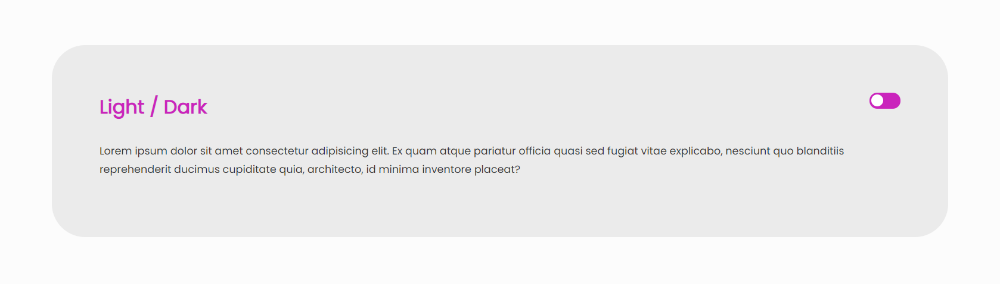
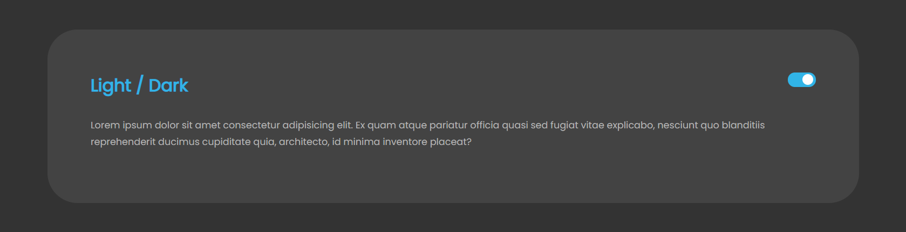

<h1 align="center">
    
</h1>

[](https://forthebadge.com)
[](https://forthebadge.com)

---

## 📑 Description

Project developed from a video on the [Rocketseat YouTube channel](https://www.youtube.com/channel/UCSfwM5u0Kce6Cce8_S72olg). 💜

- [x] [Video: Dark Mode raiz com CSS e JavaScript | Code/Drops #24](https://www.youtube.com/watch?v=BvhYm0BOLvA) 🎥

## 📺 Demonstration





---


## 👨‍💻 JavaScript code

``` js

const html = document.querySelector("html")
const checkbox = document.querySelector("input[name=theme]")

const getStyle = (element, style) => 
    window
        .getComputedStyle(element)
        .getPropertyValue(style)

const initialColors = {
    bg: getStyle(html, "--bg"),
    bgPanel: getStyle(html, "--bg-panel"),
    colorHeadings: getStyle(html, "--color-headings"),
    colorText: getStyle(html, "--color-text")
}

const darkMode = {
    bg: "#333333",
    bgPanel: "#434343",
    colorHeadings: "#e4d720",
    colorText: "#b5b5b5"
}

const transformKey = key => 
    "--" + key.replace(/([A-Z])/, "-$1").toLowerCase()  

const changeColors = (colors) => {
    Object.keys(colors).map(key => {
        html.style.setProperty(transformKey(key), colors[key])
    })
}

checkbox.addEventListener("change", ({ target }) => {
    target.checked ? changeColors(darkMode) : changeColors(initialColors)
})

```